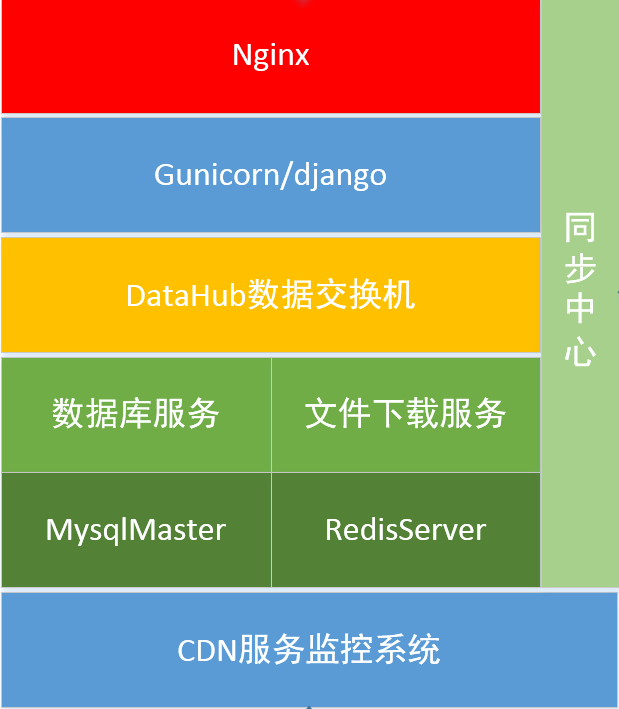
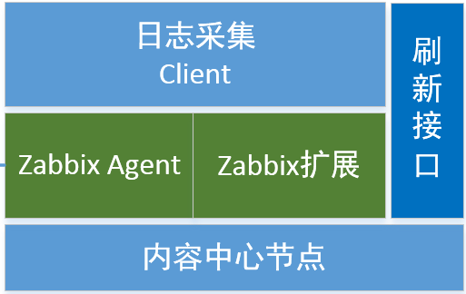

## 4.1 CDN服务监控简介

CDN服务监控主要负责全国内容中心的运行状态信息采集。作用：实时监测全国内容中心各个服务器节点工作状态，及时发现异常服务器，为网络运维人员提供维护依据。运维人员通过提供的信息，判断服务节点当前工作状态，在第一时间恢复服务节点工作状态，从而提高CDN加速质量。中国电信天翼高清CDN系统总体架构如上图0所示，按照系统功能结构设计：业务监控管理、数据整合管理、内容中心节点。 业务监控管理和数据整合管理部署在中央节点（主备），内容中心节点为采集数据端分别部署在被监视端分布式采集数据，其中所有对外接口都有中央模块提供并调用。

## 4.2  业务监控简介

CDN运营管理平台部署在管控中心节点，为了系统安全性，采用双机房主备部署。由应用服务器、数据库服务器和文件下载服务器组成。

应用服务器 ：采用Nginx+Gunicorn/Django结构，由2台服务器组成，配置负载均衡，防止单点故障，提供系统健壮性。

数据库服务器 ：使用Mysql作为基本数据存储数据库。数据库服务器3台，进行 数据主主从配置，同时实现读写分离。使用Redis作为缓存数据库：由2台服务器组成，防止单点故障，提供系统健壮性。

文件下载服务器 ：使用Nginx来搭建文件下载服务器。由2台服务器组成，防止单点故障，提供系统健壮性，服务器上的文件做自动同步。

## 4.3  数据整合

主要是对内容中心节点采集的数据处理，其中系统级监控采用zabbix采集实现，日志级监控采用logstash+kafaka方式采集。

分布式消息系统由kafka和zabbix搭建，可以接收内容中心各个节点的监控数据以及日志数据。中心节点采集到的数据统一输入后，根据不同数据类型，交由相应的模块处理，日志信息交由kafaka统一存储，其它数据有zabbix统一接收及管理。

数据收集后的存储位置统一放置在Ceph云存储上，方便数据容灾、备份的需要。数据的统一查询和展示，有对应的数据库程序获取ceph上的数据，做过滤、关联处理后交付管理平台。

收集到所有的数据后，管理端可通过spark对其做进一步处理，如有效数据过滤、数据集交并运算、热点查询等。构建在Spark上处理Stream数据的框架，基本的原理是将Stream数据分成小的时间片断（几秒），以类似batch批量处理的方式来处理这小部分数据。Spark Streaming构建在Spark上，一方面是因为Spark的低延迟执行引擎（100ms+），虽然比不上专门的流式数据处理软件，也可以用于实时计算，另一方面相比基于Record的其它处理框架（如Storm），一部分窄依赖的RDD数据集可以从源数据重新计算达到容错处理目的。此外小批量处理的方式使得它可以同时兼容批量和实时数据处理的逻辑和算法。

## 4.4 内容中心节点

提供刷新接口，上报数据的client和zabbix数据采集端，zabbix自带默认的采集一些基础信息，当前为监控业务方面的内容，须对zabbix做扩展开发。

## 4.5 监控数据收集及可视化

\* 监控系统能够自定义监控的内容，可以自己写脚本来收集需要的数据

\* 数据要保存在数据库集群中，这样以后需要的时候可以对这些数据进行分析计算

\* 数据可视化要直观好用。

 

