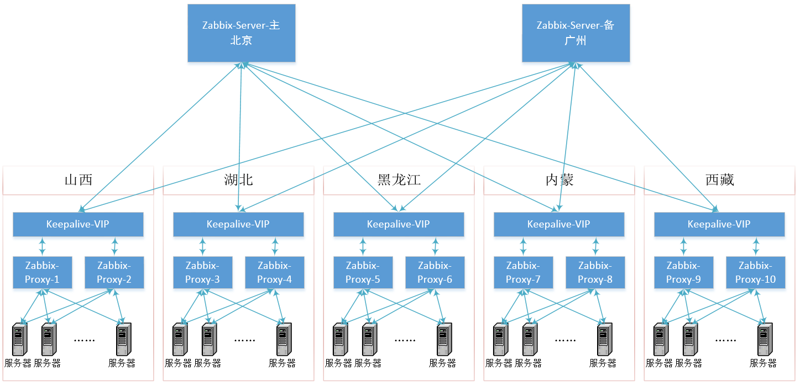

# **各省父基础监控设计方案**

### **背景介绍**

目前各省父层由于临近春节重保，为防止各类突发情况发生，各部门需快速反应第一时间解决问题。实现此目标，需要提供系统必要、实时的各种数据集，为排查故障提供依据。目前的监控系统因为种种原因，不具备实时监控、处理的能力。为此我们在设计之初，以尽可能满足各类需求为前提，重新多系统做了设计，具体可看下文。

### **设计拓扑**

根据当前多省的情况，设计拓扑图如下：

### **部署实现**

<<<<<<< HEAD

=======
##### Agent应该具备的能力

1.支持转ping功能，定义如下net.ping[type,target-ip, count, timeout, interval, size ]：
    
    key：net.ping
    参数说明：
    type:(loss,time_min,time_avg,time_max)
    target-ip：转ping的IP地址
    count：ping的次数
    timeout：ping的超时值
    interval：每次ping的间隔
    size：每次ping的包大小
    fping -qa -c${3:-8}  -t${4:-500} -i${5:-25} -p 500 -b${6:-56} $2

2.支持自动更新agent域名接口

    key：agentd.server.update
    参数：
    target：域名地址，多个域名以逗号隔开
    
    key：agentd.serveractive.update
    参数：
    target：域名地址，多个域名以逗号隔开

3. 机器开启自启动
>>>>>>> 9be7906743a77b5494ffcf7ebc5ff19e9c668bbf
##### Agent到Proxy策略

各个省内的agent做一个独立的域， 配置两个独立的推送域名，分别向两个省内proxy推送数据。
如以山西为例：

所有agent配置如下域名：sx.a.proxy.monitor.ctzcdn.com   sx.b.proxy.monitor.ctzcdn.com

##### Proxy到Server策略

各省两台proxy使用keepalive互为备份做高可用，具体操作看下：

> 两台proxy域名分别是：

    sx.a.proxy.monitor.ctzcdn.com sx.b.proxy.monitor.ctzcdn.com

> vip域名：

    sx.proxy.monitor.ctzcdn.com

Server通过域名主动向proxy发送GET请求获取数据查灵活调度的功能；

##### Agent应该具备的能力

1. 支持转ping功能，定义如下net.ping[target-ip, count, timeout, interval, size ]：

        key：net.ping
        参数说明：
        target-ip：转ping的IP地址
        count：ping的次数
        timeout：ping的超时值
        interval：每次ping的间隔
        size：每次ping的包大小

2. 支持自动更新agent域名接口

        agentd.serve.update[target]
        key：agentd.serve.update
        参数：
        target：域名地址，多个域名以逗号隔开
       
        agentd.serveractive.update[target]
        key：agentd.serveractive.update
        参数：
        target：域名地址，多个域名以逗号隔开

3. 侦测TCP链接状况
4. 侦测磁盘IO情况
5. CPU温度检测

##### 使用版本

    Zabbix-Server版本：3.4
    Zabbix-Proxy版本：3.4
    Zabbix-Agent版本：3.4

